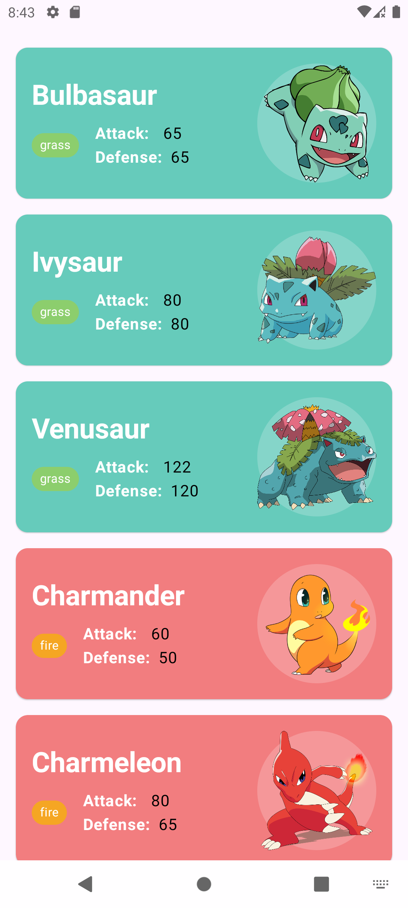

# Pokemon App

A simple Android application that displays a list of Pokemon with their details.

## Features

* Displays a list of Pokemon.
* Shows each Pokemon's name, type, attack points, defense points, and image.
* Uses a modern UI built with Jetpack Compose.

## Screenshot

## Built With

* [Kotlin](https://kotlinlang.org/) - First class and official programming language for Android
  development.
* [Jetpack Compose](https://developer.android.com/jetpack/compose) - Android’s modern toolkit for
  building native UI.
* [Material Design 3](https://m3.material.io/) - The latest version of Material Design.
